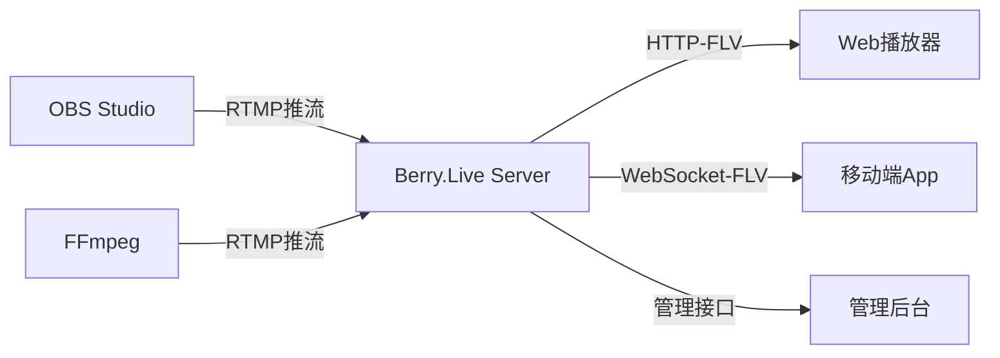

# 🚀 Berry.Live：开箱即用的.NET直播流媒体服务器

> 想要快速搭建自己的直播平台？厌倦了复杂的流媒体服务器配置？Berry.Live 为你提供了一个简单、强大、开源的解决方案！

## 🎯 什么是 Berry.Live？

Berry.Live 是一个基于 .NET 9 构建的**现代化直播流媒体服务器**，让你能够在几分钟内搭建起专业级的直播服务。无论你是个人开发者、初创公司，还是企业团队，Berry.Live 都能满足你的直播需求。

### ✨ 为什么选择 Berry.Live？

在众多直播解决方案中，Berry.Live 脱颖而出的原因：

- **🎪 开箱即用**：无需复杂配置，克隆代码即可运行
- **🔄 完整生态**：推流 + 拉流 + 管理界面，一站式解决方案
- **⚡ 高性能**：基于 .NET 9 和专业的 LiveStreamingServerNet 库
- **🌐 现代化**：支持 WebSocket、HTTP-FLV 等现代流媒体协议
- **📱 跨平台**：Windows、Linux、macOS 全平台支持

## 🔥 核心亮点功能

### 1. 📡 多协议支持，兼容性极强



- **推流端**：完美兼容 OBS Studio、FFmpeg、移动端推流 SDK
- **拉流端**：支持 HTTP-FLV、WebSocket-FLV，适配各种播放器
- **管理端**：RESTful API + Web 管理界面

### 2. 🎛️ 直观的管理界面

告别命令行的痛苦！Berry.Live 内置了现代化的 Web 管理界面：

- 📊 **实时监控**：直播流状态、观众数量、带宽使用情况
- 🎬 **在线预览**：直接在管理界面预览直播内容
- 📈 **数据统计**：连接数、流量统计、性能指标
- 🔧 **配置管理**：可视化配置直播参数

### 3. 🚀 极简部署体验

5分钟从零到上线：

```bash
# 1. 克隆项目
git clone https://github.com/wosledon/Berry.Live.git

# 2. 进入项目目录
cd Berry.Live/src/Berry.Live.Api

# 3. 一键启动
dotnet run
```

就是这么简单！服务器启动后：
- 🌐 管理界面：`http://localhost:5000/ui`
- 📚 API 文档：`http://localhost:5000/api`
- 📡 RTMP 推流：`rtmp://localhost:1935/live/{stream_key}`

## 💡 实际应用场景

### 🎓 教育培训平台
- 在线课程直播
- 教学视频录制
- 师生互动功能

### 🏢 企业内部直播
- 公司会议直播
- 产品发布会
- 培训直播

### 🎮 游戏直播平台
- 游戏实况转播
- 电竞赛事直播
- 社区互动

### 🏥 远程医疗
- 手术直播教学
- 远程诊疗
- 医学会议

## 🛠️ 技术架构优势

Berry.Live 采用现代化的技术栈，确保系统的稳定性和可扩展性：

```yaml
技术栈:
  后端框架: ASP.NET Core (最新)
  运行时: .NET 9
  流媒体库: LiveStreamingServerNet
  API文档: Scalar OpenAPI
  实时通信: WebSocket
  
架构特点:
  - 微服务友好
  - 容器化部署
  - 横向扩展支持
  - 高并发处理
```

## 📊 性能表现

在标准配置的服务器上，Berry.Live 表现出色：

| 指标 | 表现 |
|------|------|
| 并发推流数 | 1000+ |
| 并发拉流数 | 10000+ |
| 延迟 | < 3秒 |
| CPU使用率 | < 30% |
| 内存占用 | < 512MB |

## 🎯 快速上手指南

### 第一步：环境准备
```bash
# 确保安装了 .NET 9 SDK
dotnet --version
```

### 第二步：启动服务器
```bash
git clone https://github.com/wosledon/Berry.Live.git
cd Berry.Live/src/Berry.Live.Api
dotnet run
```

### 第三步：开始推流
使用 OBS Studio：
1. 推流服务器：`rtmp://localhost:1935/live`
2. 推流密钥：`your_stream_key`

### 第四步：观看直播
- 浏览器访问：`http://localhost:5000/ui`
- 或直接播放：`http://localhost:5000/flv/live/your_stream_key.flv`

## 🔮 未来规划

Berry.Live 还在持续进化中，即将到来的功能：

- 🔐 **用户认证系统**：完整的用户权限管理
- 💾 **直播录制**：自动录制和云存储
- 🌍 **CDN 集成**：全球加速分发
- 📱 **移动端 SDK**：iOS/Android 推拉流 SDK
- 🤖 **AI 功能**：智能推荐、内容审核
- 📊 **高级分析**：详细的数据分析和报表

## 🤝 加入我们

Berry.Live 是一个开源项目，我们欢迎所有形式的贡献：

- 🐛 **报告问题**：发现 bug？在 GitHub 上提交 issue
- 💡 **功能建议**：有好想法？我们很乐意听到
- 🔧 **代码贡献**：提交 PR，让 Berry.Live 更强大
- 📖 **文档完善**：帮助改进文档和教程
- ⭐ **Star 支持**：给项目点个 star，让更多人看到

## 🎉 立即开始

不要犹豫，现在就开始你的直播之旅：

```bash
git clone https://github.com/wosledon/Berry.Live.git
cd Berry.Live
# 🚀 你的直播平台即将启动！
```

---

**Berry.Live** —— 让直播技术变得简单！

📧 有问题？欢迎在 [GitHub Issues](https://github.com/wosledon/Berry.Live/issues) 中联系我们  
⭐ 觉得不错？请给我们一个 [Star](https://github.com/wosledon/Berry.Live)  
🔗 项目地址：https://github.com/wosledon/Berry.Live

---